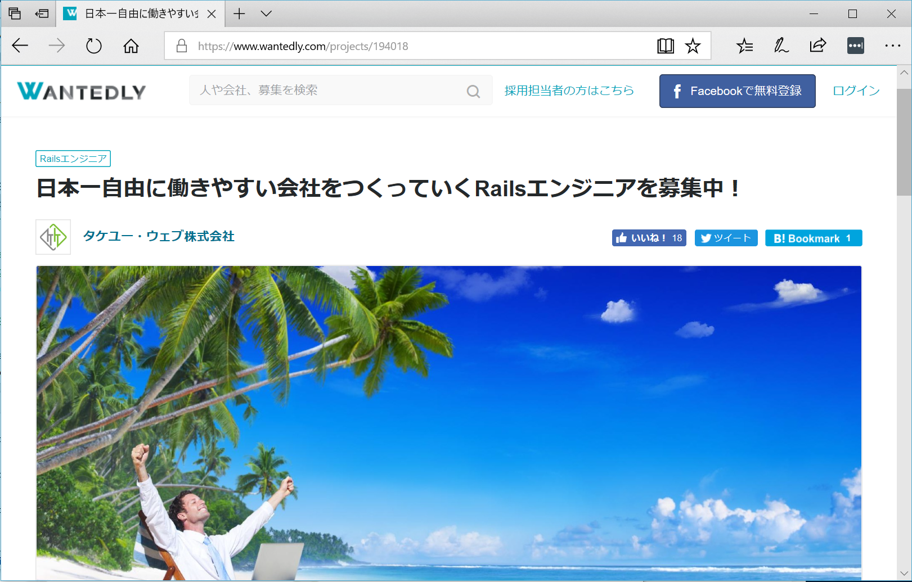

# Rails meets Content Security Policy

author
:  竹内雄一

institution
:  Takeyu Web Inc.

allotted-time
:  10m

# @takeyuweb

- 2008年〜フリーランス
- 2016年 法人成り
- Rails 1.1〜
- Saitama.rb主宰

# Takeyu Web Inc.

{:relative_width='100'}

# Rails 5.2 Content Security Policy

config/initializers/content_security_policy.rb

```ruby
Rails.application.config.content_security_policy do |policy|
  policy.default_src :self, :https
  policy.font_src    :self, :https, :data
  policy.img_src     :self, :https, :data
  policy.object_src  :none
  policy.script_src  :self, :https
  policy.style_src   :self, :https
 
  # Specify URI for violation reports
  policy.report_uri "/csp-violation-report-endpoint"
end
```

# Rails 5.2 Content Security Policy

Override policy inline

```ruby
class PostsController < ApplicationController
  content_security_policy do |p|
    p.upgrade_insecure_requests true
  end
end
```

# Rails 5.2 Content Security Policy

[https://speakerdeck.com/yyagi/rails-5-dot-2-part1?slide=23](https://speakerdeck.com/yyagi/rails-5-dot-2-part1?slide=23)

[http://guides.rubyonrails.org/security.html#content-security-policy](http://guides.rubyonrails.org/security.html#content-security-policy)

# What's CSP?

IPA ISEC　セキュア・プログラミング講座より

> Content Security Policy は、スクリプトのロードと実行等に強い制約を設ける機能

[https://www.ipa.go.jp/security/awareness/vendor/programmingv2/contents/705.html](https://www.ipa.go.jp/security/awareness/vendor/programmingv2/contents/705.html)

# HTTP Header

```
GET /index.html
Host: test.host

HTTP/1.1 200 OK
Content-Security-Policy: default-src 'self'
```

# default-src 'self'

```html
<script>alert("実行されない");</script>
<script src="実行される.js"></script>
<script src="://test.host/scripts/実行される.js"></script>
<script src="://blocked.host/scripts/実行されない.js"></script>
```

# script-src 'https:'

```html
<script src="http://test.host/scripts/されない.js"></script>
<script src="https://test.host/scripts/実行される.js"></script>
<script src="https://xxx.host/scripts/実行される.js"></script>
```

# script-src 'self' 'unsafe-inline'

```html
<script>alert("実行される");</script>
```

# script-src 'nonce-xxxxxxxxxxxxxx'

nonce: number used once

```html
<script>alert("実行されない");</script>

<script nonce="xxxxxxxxxxxxxx">alert("実行される");</script>
```

# report-uri /csp-report

ブロックしたとき、CSPレポートを送信する

POST /csp-report

```json
{
  "csp-report": {
    "blocked-uri": "self",
    "document-uri": "http://localhost:3000/",
    "original-policy": "script-src ...",
    "referrer": "",
    "script-sample": "onclick attribute on A element",
    "source-file": "http://localhost:3000/",
    "violated-directive": "script-src"
  }
}
```

# Directives

`base-uri` `child-src` `connect-src`  `default-src` `font-src` `form-action` `frame-ancestors`  `frame-src` `img-src`  `manifest-src` `media-src` `object-src` `script-src`  `style-src`  `worker-src`

# Content-Security-Policy-Report-Only

Report Only

```
Content-Security-Policy-Report-Only: default-src https: report-to https://test.host/csp-report
```

# Supported browsers

[ブラウザー実装状況 | Content Security Policy (CSP) - HTTP | MDN](https://developer.mozilla.org/ja/docs/Web/HTTP/CSP#%E3%83%96%E3%83%A9%E3%82%A6%E3%82%B6%E3%83%BC%E5%AE%9F%E8%A3%85%E7%8A%B6%E6%B3%81)

# Rails integration

config/initializers/content_security_policy.rb

```ruby
Rails.application.config.content_security_policy do |policy|
  policy.default_src :self, :https
  policy.font_src    :self, :https, :data
  policy.img_src     :self, :https, :data
  policy.object_src  :none
  policy.script_src  :self, :https
  policy.style_src   :self, :https
 
  # Specify URI for violation reports
  policy.report_uri "/csp-violation-report-endpoint"
end
```

# Rails integration

Override policy inline

```ruby
class PostsController < ApplicationController
  content_security_policy do |p|
    p.upgrade_insecure_requests true
  end
end
```

# Rails integration

```erb
<%= javascript_tag do %>
alert('Without nonce');
<% end %>

<%= javascript_tag nonce: true do %>
  alert('With nonce');
<% end %>
```

# Supported directives

[actionpack/lib/action_dispatch/http/content_security_policy.rb](https://github.com/rails/rails/blob/0ac549a49a690416865793e48bd7c3d3afe91a94/actionpack/lib/action_dispatch/http/content_security_policy.rb)

# Enjoy Secure Programing!

{:relative_width='100'}
