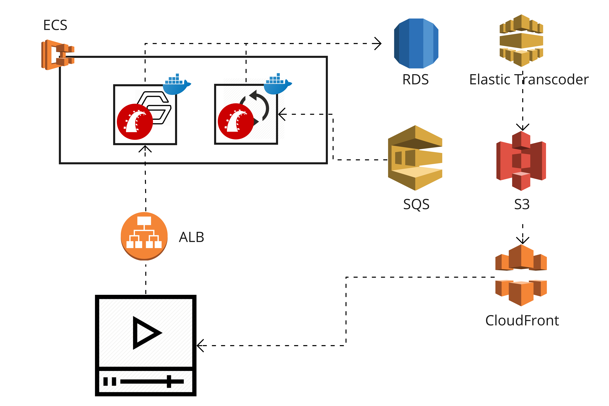
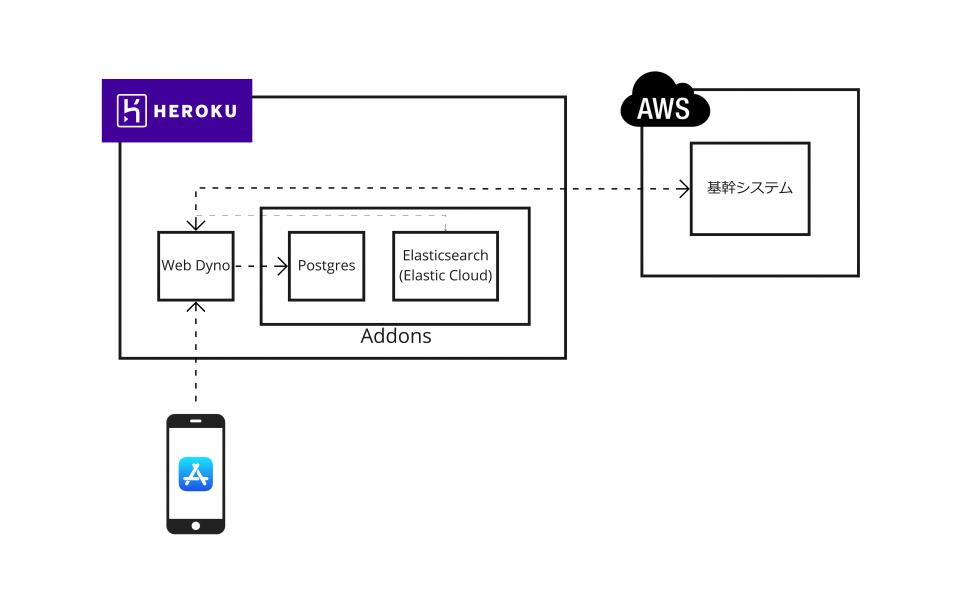

# Business on Rails

subtitle
:    受託開発におけるRailsとの関わり方
author
:   竹内雄一
institution
:   タケユー・ウェブ株式会社 

# 今日話すこと

* Rails受託開発の会社です。
* こういうことしてます。
* 受託開発でRails良いと思います。

# タケユー・ウェブ株式会社について

* Rails受託開発会社

# Rails受託開発会社

* サービス事業者の依頼に応じて
* Rails開発チームを提供し
* 開発のすべてをまるっと引き受ける会社

# Rails開発チーム

|項目       |内容       |
|:-----------|:------------|
|**お客様**        |サービス事業者         |
|**提供するもの**        |Rails開発チーム         |
|**担当領域**        | 要件定義 〜 実装 |
|**納品** | お客様による |

# 事例①：動画配信サービス

{:relative_width='100'}

# 事例①：お客様のご要望

- AWSを活用すること
- 長く継続して改善し続けられるシステム
- サービスの機能要件

# 事例①：弊社担当領域

- 要件定義
- システム設計
- 実装
- 運用
  - 継続的デリバリ

# 事例②：モバイルアプリバックエンド

{:relative_width='100'}

# 事例②：お客様のご要望

- インフラ管理を楽にする
- リリース後納品・お客様開発チームに引き継ぎ
- エンジニアチームを統括

# 事例②：弊社担当領域

- システム設計
- バックエンド実装
- iOSアプリ開発マネジメント
- コーチング

# 受託開発におけるRails

- Rails way
- Rubygems
- 活発なコミュニティ

# Rails way とはなにか

- 規約
- Rails らしいやりかた
- フルスタック

# Rails way ここがいい

- 保守しやすいコードを納品
- まずはすばやく立ち上げたいニーズにも対応

# Rubygems

- たくさんのgemが活発に開発
- うまく使えば工数削減

弊社では少し保守的...

# Rubygems 使いすぎリスク

- アップデートできない
- 黒魔術的で理解しにくい
- DSLなど独自の知識を要求

# Rubygems 基本方針

- 必要十分である
- 薄くコードの見通しが良い
- 既存のメソッドを変えない

# Rubygems 理由

- アップデートを容易にする
- 仕事のマッチポンプをなくす
- 納品後の引き継ぎを容易にする

# 活発なコミュニティ

- 情報源豊富
- アウトプットの場
- 人とのつながり
  - 思わぬ仕事や出会いがあることも

# まとめ

- Railsは納品のある受託開発でも有効
- 開発力足りないときに開発会社を使うという選択

# ご相談ください！

- Rails経験が不足していて不安
- 自社に開発力が足りない
- まるごと任せたい
